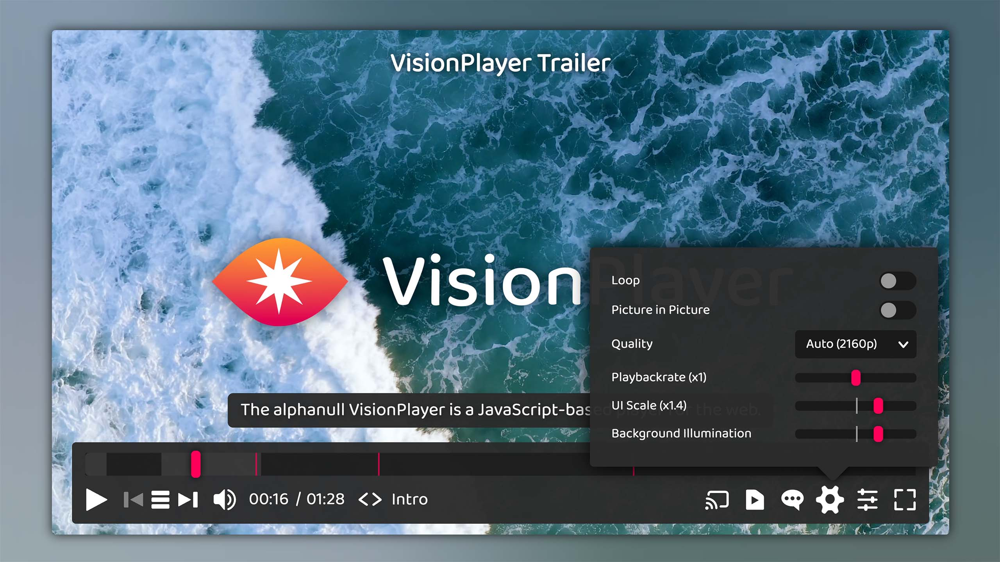

<div class="jsdoc-hidden" align="center">

  
  
  [](./docs/guides/Setup.md)
  

</div>

<div align="center">
  
</div>

# VisionPlayer

The **VisionPlayer** by **[alphanull](https://alphanull.de)** is a highly modular, lightweight, and feature-rich JavaScript video player for the modern web. Designed as a flexible component system, the player allows for deep customization, simple integration, and full control over both appearance and functionality. Whether you're building a minimal player for a single video or a complex interface supporting multilingual, multi-quality streaming with overlays and playlist management — this player adapts to your needs.

## Features

- **Fully modular architecture** — Components can be easily added, removed, or replaced without modifying the core, with nearly 50 components already provided.
- **Native HTML5 video support** — Plays MP4, WebM, and other browser-supported formats.
- **Multi-language and multi-quality stream selection** — Each stream can offer multiple languages, resolutions, and encodings. Quality can be automatically selected depending on screen resolution.
- **Streaming support** — DASH and HLS support, both VOD and Live Streaming, fully integrated into the player UI including subtitles, audio and quality selection.
- **FairPlay, Widevine, and PlayReady DRM** — Encrypted media playback for premium content.
- **Chromecast and AirPlay** — External device playback handling with full UI synchronization.
- **Playback Controls** — Play/pause, scrubber, volume, playback rate, fullscreen, loop and more.
- **Playlist Management** — Seamless navigation between multiple media items, with optional shuffle and loop modes.
- **Subtitle support** — WebVTT rendering with support for positioning, all writing modes and built in HTML sanitiser, TTML (IMSC1/EBU-TT-D) handling, and native `<track>` integration for iOS compatibility.
- **Dynamic Overlays** — Posters, images and other content at defined cue points.
- **Thumbnails** — Display thumbnails in the scrubber tooltip or use them for a special scrubbing mode.
- **Chapters** — Display Chapters in the controller or scrubber tooltip.
- **Picture-in-Picture** — Play video in a separate overlay window.
- **Picture and Audio Controls** — Adjust video brightness, contrast, and more, or fine-tune your audio with a multiband equalizer.
- **Advanced Accessibility** — Comprehensive accessibility features including Picture & Audio Controls for visual/auditory impairments, keyboard navigation, and screen reader support.
- **Local playback** — Play local media by selecting or dragging and dropping files.
- **Audio and Video Visualizations** — Including bar visualizer, ambient light effects, and waveform displays.
- **Extensive Media Data Format** — With support for extensible metadata and multiple media variants, representations, and encodings.
- **Extended Localization** — Builds includes the following out‑of‑the‑box UI translations: English, German, Spanish, Portuguese, French, Italian, Russian, Chinese (Simplified), Japanese, Korean, Hindi, Arabic & Turkish.
- **Scalable, responsive UI** — UI intelligently adapts to every player size, UI scale factor is dynamically changeable by the user.
- **Theme support** — Built-in dark and light modes, with CSS custom properties for full theming flexibility.
- **Easy Embedding** — Supports converting existing video tags and any other elements with `data-vip` attributes, optionally with autoloading.
- **Minimal global footprint** — Only one exported class (`VisionPlayer`), with everything else modular and encapsulated.
- **Single, zero dependency bundle File** — VisionPlayer bundles all code, styles, SVG assets and language files into a zero-dependency single build artifact – making integration seamless.
- **Optimized Performance** — GPU-accelerated transitions, minimal reflows, and efficient DOM updates.
- **Security Features** — Optional Secure Mode with Shadow DOM, API protection and XSS prevention.
- **1-Minute Setup** — Get from `npm install` to working demo in under 60 seconds with vite dev server.

## Screenshot



## Demo

Just hop over to **[visionplayer.io](https://visionplayer.io)** to take a test drive! Right now, the page features demos identical to the ones coming with the development server, but in the future this site will deliver more information about the VisionPlayer, so stay tuned.

## Installation

### Install using npm

```bash
npm install @alphanull/visionplayer
```

#### Import

```javascript
import VisionPlayer from '@alphanull/visionplayer'; // Default - full feature set
import VisionPlayerBasic from '@alphanull/visionplayer/basic'; // Basic - core features only
import VisionPlayerHeadless from '@alphanull/visionplayer/headless'; // Headless - no UI components
import VisionPlayerSecure from '@alphanull/visionplayer/secure'; // Secure - maximum security features
```

This imports the `.mjs` versions (found in `/dist/mjs`). Those act as as modules, exporting the main VisionPlayer class. These build versions are not minified - assuming you will do this yourself in the build process - and also include source maps for easier debugging, if necessary. Importing this way is optimal if you want to incorporate the player as a single packaged module in your own code.

### Use as script

To directly embed the player using a `<script>` tag, use either the `.js` Version of the build (found in `/dist/js`). This version is minified and self executing, exposing a global `window.VisionPlayer` object. Or, just include the file directly from a CDN:

```html
<script src="/dist/js/VisionPlayer.min.js"></script> <!-- default build -->
<script src="https://unpkg.com/@alphanull/visionplayer@1/dist/VisionPlayer.basic.min.js"></script> <!-- basic build -->
<script src="https://cdn.jsdelivr.net/npm/@alphanull/visionplayer@1/dist/VisionPlayer.secure.min.js"></script> <!-- secure build -->
```

For full setup instructions, see the [Setup Documentation](docs/guides/Setup.md).

## Examples

### Basic usage

```javascript
import VisionPlayer from '@alphanull/visionplayer';
new VisionPlayer(document.body, '/path/to/media.mp4');
```

Or via script tag and autoload:

```html
<script data-vip-autoload src="/dist/js/VisionPlayer.min.js"></script>
<video data-vision-player controls src="/path/to/media.mp4"></video>
```

### With `mediaData` object

```javascript
const mediaData = {
    title: 'My Video',
    src: '/path/to/media.mp4'
};

new VisionPlayer(target, mediaData);
```

### With custom `playerConfig`

```javascript
const playerConfig = {
    ui: {
        autoHide: false
    }
};

new VisionPlayer(target, mediaData, playerConfig);
```

## Documentation

Additional docs cover the following topics:

- [**Setup**](docs/guides/Setup.md)
- [**Media Data Format**](docs/guides/MediaData.md)
- [**Configuration**](docs/guides/Configuration.md)
- [**API**](docs/guides/API.md)
- [**Components**](docs/guides/Components.md)
- [**Accessibility**](docs/guides/Accessibility.md)
- [**Security**](docs/guides/Security.md)
- [**Shadow Dom**](docs/guides/ShadowDom.md)
- [**Developing for VisionPlayer**](docs/guides/Development.md)

In addition, a detailed JSDoc documentation covering all modules and their methods, members and events can be generated using `npm run doc`, which then will reside in `/docs/jsdoc`. This generated documentation can also be accessed via the microsite: [VisionPlayer JSDoc](https://visionplayer.io/docs)

## Browser Support

VisionPlayer supports all major browsers on all platforms (i.e. macOS, iOS, Windows, Android & Linux) released since ~2019-2020 and later, including Chrome (v79+), Firefox (v75+) and Safari (v13+). **Note:** The [Secure Build](docs/guides/Security.md) requires native ES2022 support.

### Known Issues

- Sharpen Video Filter does not work on Safari - see [https://bugs.webkit.org](https://bugs.webkit.org/show_bug.cgi?id=184601). Not solvable unless Apple gets its act together - and it is generally recommended to use a "proper" browser anyways, like Firefox or Chrome.

- If the ambient visualizer is enabled (as in the demo), you may get the warning *Canvas2D: Multiple readback operations using getImageData are faster with the willReadFrequently attribute set to true.* Actually, with that setting enabled, performance gets **worse** (up to five times!) on both a windows and a mac laptop. However, an Android tablet showed better performance with this setting, while an iPad did not show much difference. Not sure why exactly this is the case - seems like different rendering pipelines are triggered - and what would be the best heuristics to select the optimal setting. So for now, `willReadFrequently` is disabled until the situation is resolved.

## License

[MIT License](https://opensource.org/license/MIT)

Copyright © 2025–present Frank Kudermann @ [alphanull.de](https://alphanull.de)